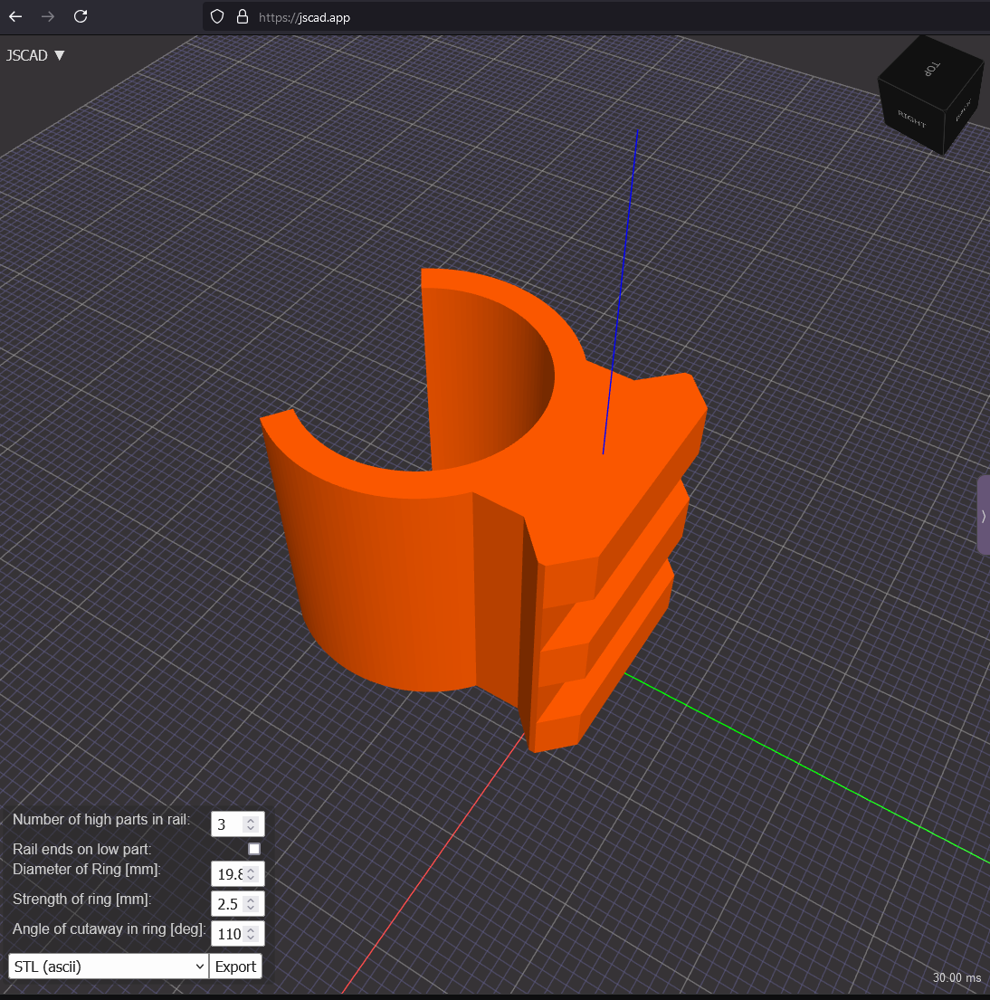

# jscad-rischwa
jscad.app files for 3d objects. contains a definition for configurable length and diameter STANAG 4694 / picatinny adapter clip.
Just go to https://jscad.app , paste the [stanag-clip.js](stanag-clip/stanag-clip.js) contents into the editor and use the parametrization in the bottom left to configure the model to generate:

I used this to create an adapter for my MantisX on the barrel of my FWB 900 air rifle.
As I'm new to CAD, there are probably better ways to represent the model in code, but it works and maybe can help someone else.
